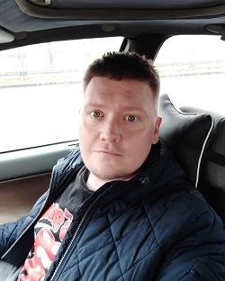

# Siarhei Paltarzhytski

## My Contact Info:
* Phone: +375 25 905-65-41
* E-mail: robot.chicken412@gmail.com
* GitHub: [AvoKatto](https://github.com/AvoKatto)
* Discord: Siarhei Paltarzhytski(@AvoKatto)
****
## About Me
I am 32 years old, I work as a microelectronics engineer at the Lithuanian company UAB "Balitana" and study with a front-end developer at RS School.
****
## Skills
* __HTML__ 
* __Git__
* __JavaScript__ (Basic)
* I own __Zbrush , Photoshop , AtoCAD , Solidworks__
****
## Education
* __Minsk State Mechanical Engineering College__
  * _2006 - 2010_
  * speciality - internal combustion engine 
  * qualification - mechanical technician
* __Belarusian State University of Informatics and Radioelectronics__
  * _2011 - 2018_  
  * speciality - Modeling and computer design of radio-electronic equipment
  * qualification - radio electronics engineer
****
## Experience
* _2010 - 2011_ "КУП Минсксанавтотранс"
  * Position - mechanic
* _2011 - 2013_ "ООО Автошаг"
  * Position - auto parts sales consultant
* _2013 - 2014_ "ЧТУП Кплюс Авто"
  * Position - auto parts sales consultant
* _2014 - 2015_ "ООО Тессел Трейдинг Групп"
  * Position - auto parts sales consultant
* _2015 - 2021_ "ИП Казаков Д.И. Remmedia.by"
  * Position - microelectronics engineer / Repair specialist / manager
* _2021 - Until now_ UAB "Balitana"
  * Position - microelectronics engineer / Repair specialist / manager
****
## Languages
* Russian - native speaker
* Belarusian - native speaker
* English - A1 (A2 in process…)
****
## Code Examples
```
function sum(a, b) {
  return a + b;
}

let result = sum(1, 2);
alert( result );
```